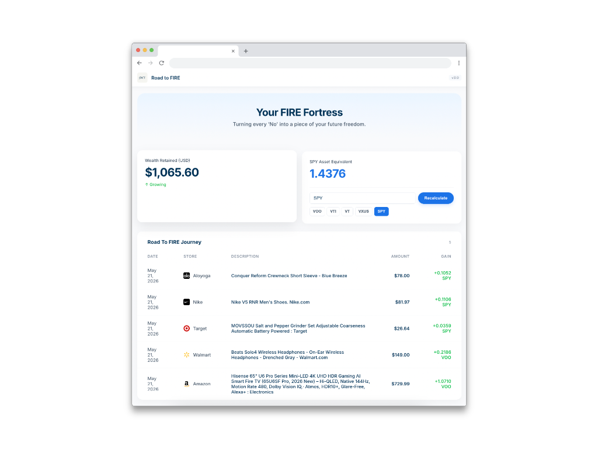
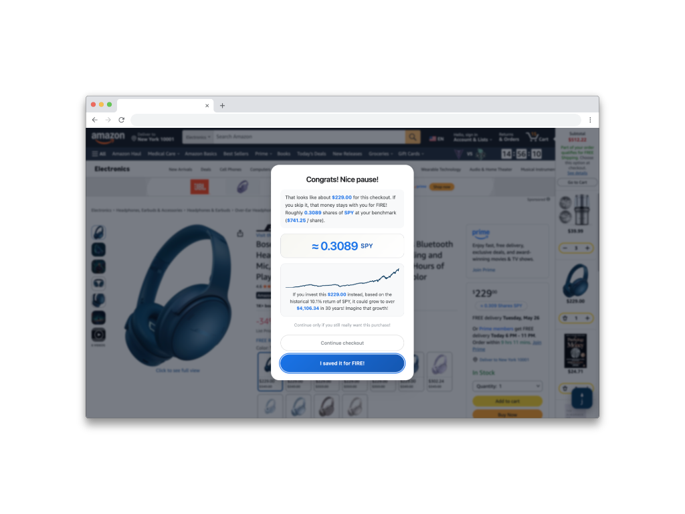
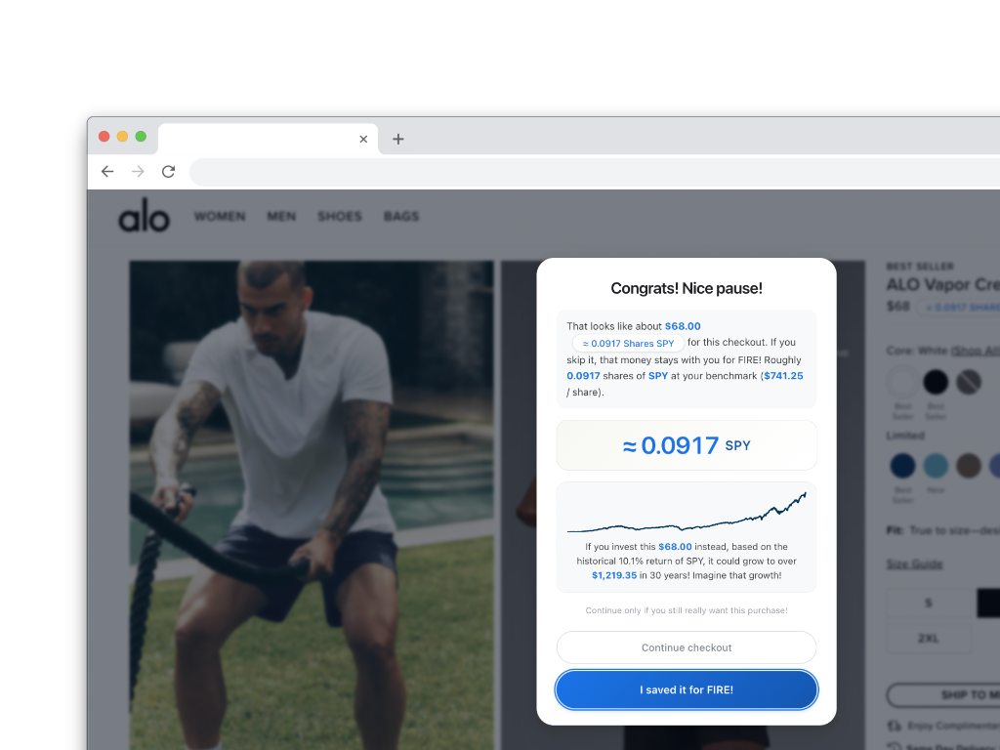
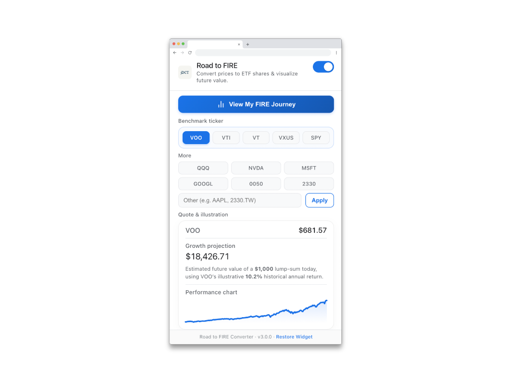
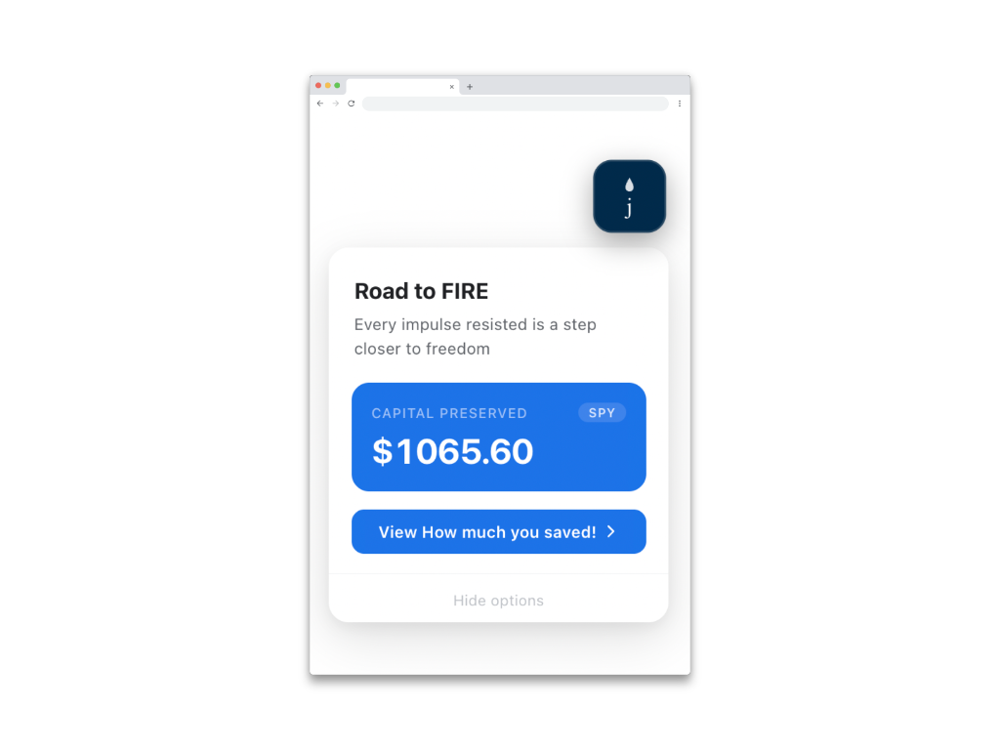

# Road to FIRE 🚀

Visualize your opportunity cost, combat impulse buying, and track your path to Financial Independence, Retire Early (FIRE) directly inside your browser.

[English](#english) | [繁體中文](#繁體中文)

---

## English

"Road to FIRE" is a powerful mindset tool that transforms how you perceive the value of your money. By automatically converting everyday consumer prices into equivalent ETF shares and displaying your long-term compounding growth, it serves as your financial conscience during online shopping.

### 📸 Preview

  
   
  <em>Interactive FIRE Dashboard to track your progress</em>

  
  
   
  <em>Mindful Checkout Interceptors to pause impulse buying</em>

  
  
   
  <em>Popup controls and persistent floating widget</em>

### ✨ Key Features
- **Real-Time Price Conversion**: Instantly translates checkout totals into equivalent shares of index funds (e.g., VOO, VTI, SPY, QQQ, 0050, 2330).
- **Mindful Checkout Interception**: Triggers a customized "Pause and Reflect" popup before finalizing a purchase, showing the compound interest value of that money over 10, 20, or 30 years.
- **Save for FIRE**: Choose to skip the purchase, click the "I saved it for FIRE!" button, and redirect that money toward your investment portfolio.
- **Visual Progress Dashboard**: Track all your preserved wealth and visualize your path to freedom with interactive growth charts and saved purchase history.

---

## 繁體中文

「Road to FIRE」是一款強大的心態輔助工具，旨在幫助你對抗衝動購物並將「機會成本」視覺化。透過在網頁與結帳頁面上自動將價格換算成等值的 ETF 股數，它將徹底改變你對金錢價值的認知。

### ✨ 核心功能
- **即時價格換算**：將結帳總額即時轉化為等值的指數基金股數（如：美股 VOO, VTI, SPY, QQQ，或台股 0050, 2330）。
- **正念結帳攔截**：在結帳前跳出客製化的「停下來思考」視窗，為你試算這筆錢在 10、20、30 年長期複利後的巨大未來價值。
- **為 FIRE 儲蓄**：選擇放棄購買，點擊「我為 FIRE 省下了這筆錢！」按鈕，這筆資金就會記錄並存入你的虛擬投資組合中。
- **視覺化儀表板 (Dashboard)**：在精美的儀表板中追蹤所有省下來的金額，並見證你的機會成本成長軌跡。

---

## 🛠️ Development & Installation / 開發與安裝

1. Clone this repository to your local machine.
2. Open Chrome and navigate to `chrome://extensions/`.
3. Enable **Developer mode** (top-right corner).
4. Click **Load unpacked** (top-left corner) and select the project folder.
5. Start visiting your favorite e-commerce sites (e.g., Amazon, Alo Yoga) and build your Road to FIRE!

---

## 🔒 Privacy
This extension runs entirely locally on your browser. It does **not** collect, store, or transmit any personal data or shopping history.
